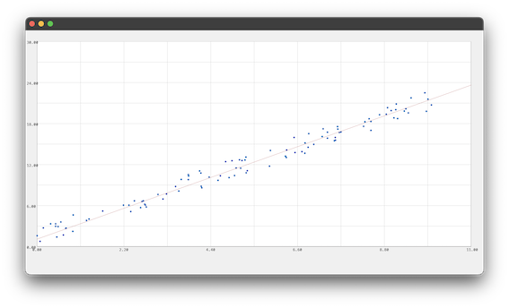

## Linear Regression Example

```ocaml
#! /usr/bin/env ylc -i
import std/Math;
import std/Arrays;


let X = array_fill 100 (fn i -> Math.rand_double_range 0. 10.);
let Y = array_fill 100 (fn i -> 2. * X[i] + 3 * Math.rand_double ());

let forward = fn (pw, pb) x -> 
  let out_feat = array_size pb;
  let out = array_fill_const (out_feat * (array_size x)) 0.;

  for i = 0 to (array_size out) in (
    out[i] := pb[0] + pw[0] * x[i]
  );
  out
  ;;

type TLinear = (
  weight: Array of Double,
  bias: Array of Double
);

let Linear = fn in_feat out_feat ->
  (
    weight: array_fill (in_feat * out_feat) Math.rand_double,
    bias:   array_fill out_feat             Math.rand_double,
  )
;;

let mse_loss = fn prediction y ->
  let aux_rec = fn i res y p ->
    match i >= array_size p with
    | true -> res
    | _ -> (
      let pred_val = p[i] in
      let target_val = y[i] in
      let diff = pred_val - target_val in
      let squared_diff = diff * diff in
      let new_res = res + squared_diff in
      aux_rec (i + 1) new_res y p
    )
  ;;
  let total_error = aux_rec 0 0.0 y prediction in
  let count = array_size prediction in
  total_error / count
;;

let sgd_optim = fn learning_rate model: (TLinear) pred X y ->
  let n = array_size pred;
  
  let grad_weight = [| 0. |];
  let grad_bias = [| 0. |];
  
  for i = 0 to n in (
    let error = pred[i] - y[i];
    let x_i = X[i]; 
    
    grad_weight[0] := grad_weight[0] + (2. * error * x_i / n);
    
    grad_bias[0] := grad_bias[0] + (2. * error / n)
  );
  
  model.weight[0] := model.weight[0] - learning_rate * grad_weight[0];
  model.bias[0] := model.bias[0] - learning_rate * grad_bias[0];
  
  model
;;

let model = Linear 1 1;

let train = fn model: (TLinear) epochs ->
  match epochs with
  | 0 -> model
  | _ -> (
    let pred = forward (model.weight, model.bias) X;
    let l = mse_loss pred Y;
    let m = sgd_optim 0.01 model pred X Y;
    train m (epochs - 1)
  )
;;

train model 100;

# Optional to view the scatter plot of input data vs the interpolated line:
# NB: using the Gui library requires using the ylc -i option in order to keep
# the parent process running and able to create windows

import gui/bindings/Gui;

Gui.create_decl_ui (fn () ->
  let p = Gui.Plt 0. 11. 0. 30.;
  let s = Gui.Scatter p (array_size X) (cstr X) (cstr Y);
  let l = Gui.LinePlt
    p
    2
    ([|0., 11.|] |> cstr)
    ([|0., 11.|] |> forward (model.weight, model.bias) |> cstr)
    ;
)
```
here's an example output plot:



Further example programs [here](../examples)
