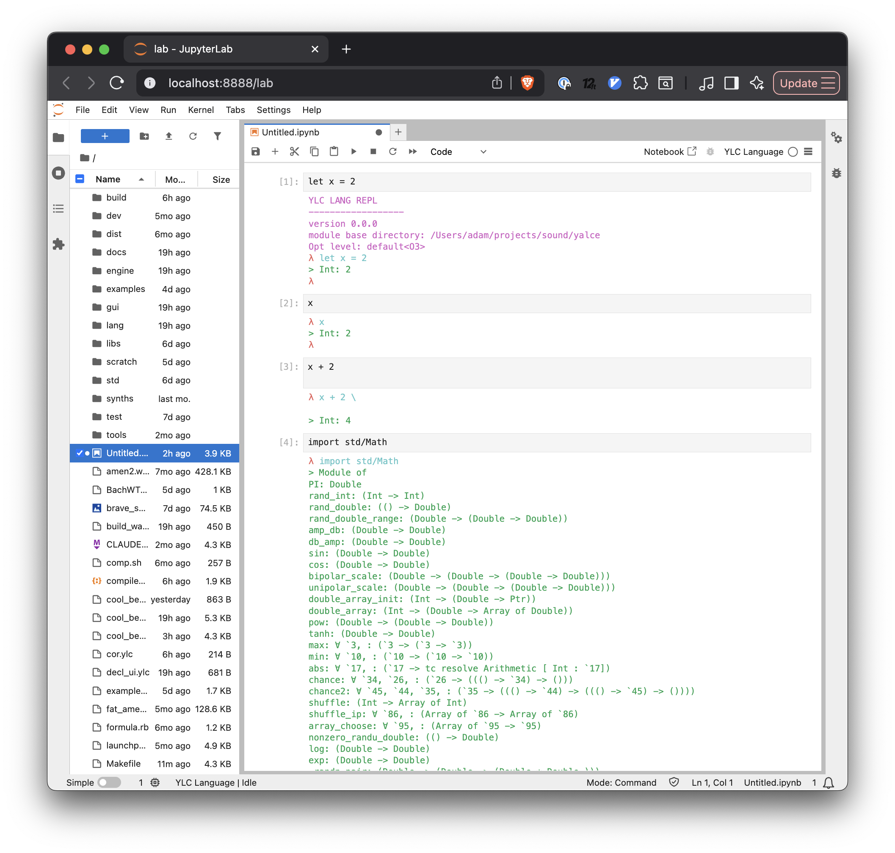

# Getting Started with YLC

This guide will help you install YLC and write your first programs.

## Installation

### Option 1: Homebrew (macOS)

```bash
brew install crawdaddie/yalce/yalce
```

### Option 2: Build from Source

#### Prerequisites

- **LLVM@20** - For JIT compilation
- **readline** - For REPL line editing
- **libsoundio** - For audio I/O
- **libsndfile** - For reading audio file formats
- **fftw3** - For FFT operations
- **SDL2** (plus **SDL2_ttf**, **SDL2_gfx**) - For GUI (optional)

On macOS with Homebrew:


#### Build Steps
1. Clone the repository:

        git clone https://github.com/crawdaddie/yalce.git
        cd yalce


2. Create a `.env` file with paths to dependencies:
   
        # .env
        export CPATH=/opt/homebrew/include
        export LIBRARY_PATH=/opt/homebrew/lib
        export LLVM_PATH=/opt/homebrew/opt/llvm@20
        export SDL2_PATH=/opt/homebrew/opt/sdl2
        export SDL2_TTF_PATH=/opt/homebrew/opt/sdl2_ttf
        export SDL2_GFX_PATH=/opt/homebrew/opt/sdl2_gfx
        export READLINE_PREFIX=/opt/homebrew/opt/readline
        export LIBSOUNDIO_PATH=/opt/homebrew/opt/libsoundio
        export LIBSNDFILE_PATH=/opt/homebrew/opt/libsndfile
        export LIBFFTW3_PATH=/opt/homebrew/opt/fftw

    Or you can use the script `./setup.sh` to download dependencies automatically and create the .env file

3. Build the compiler:

        make

   This creates the `ylc` executable in `build/ylc`.


4. (Optional) Add to your PATH:
   
        export PATH="$PATH:$(pwd)/build"

    or add to a folder in your PATH:
   
        ln -s "$PWD/build/ylc" "$HOME/.local/bin/ylc"

## Your First YLC Program

### Hello World

Create a file `hello.ylc`:

```ylc
let message = "Hello, YALCE!";
print message;
```

Run it:

```bash
ylc hello.ylc
```

## Interactive REPL

Start the REPL:

```bash
ylc
```

Try some expressions:

```ylc
λ 1 + 2
> Int: 3

λ let double = fn x -> x * 2;
> ∀ `3, : (`3 -> tc resolve Arithmetic [ `3 : Int])

λ let d = double 21 in print `{d}\n`
> ()
Int: 42
```

## YLC CLI options
### `ylc -i` 
the -i flag enters the interactive repl after all input files have been run 
```bash
ylc audio_program_setup.ylc -i
```
without input files ```-i``` is assumed, so ```ylc``` will drop you straight into the repl


### `ylc --debug-ir-pre <module>.ylc`
prints the LLVM IR (_before_ optimisation passes have been run on it) for the input module

### `ylc --debug-ir <module>.ylc`
prints the LLVM IR (_after_ optimisation passes have been run on it) for the input module

### `ylc -0<level> <module>.ylc`
the optimisation level for the LLVM compiler backend to use before execution.

the available options are `-O0`, `-O1`, `-O2` and `-O3`.    
without this option, `-O3` (the most aggressive) is used by default.  
these correspond roughly with [clang's optimisation options](https://clang.llvm.org/docs/CommandGuide/clang.html#code-generation-options)


### `ylc --test <module>.ylc`
**ylc** includes a built-in test framework:

```ocaml
# arithmetic.ylc
let test = module () ->
  let test_addition = 2 + 2 == 4;
  let test_double = (let f = (fn x -> x * 2) in f 3 == 6);
;
```
the `--test <module>.ylc` option runs the tests in the module specified:

```bash
$ ylc --test arithmetic.ylc

# Test arithmetic.ylc
-----------------------------------------
✅ test_addition
✅ test_double
2 / 2 passed
```

## Jupyter Kernel
You can set up a jupyter kernel in the project directory where you cloned the yalce project: `<yalce_dir>/dev/kernel`
```bash
make jupyter
jupyter lab
```
This assumes the `jupyter` command is installed and available, you can then use YLC in an interactive notebook format:

(You can do this also in VSCode with the jupyter extension by selecting the ylc kernel found at `<yalce_dir>/dev/kernel`)


## Next Steps
- [Language Reference](reference.md) - Learn all language features
- [Examples](examples.md) - more examples
